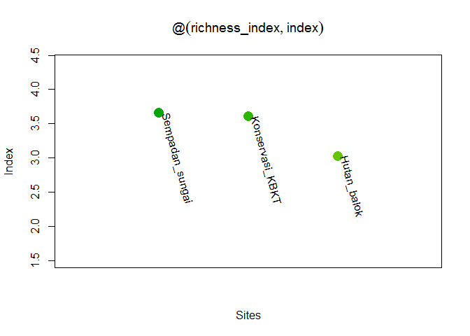
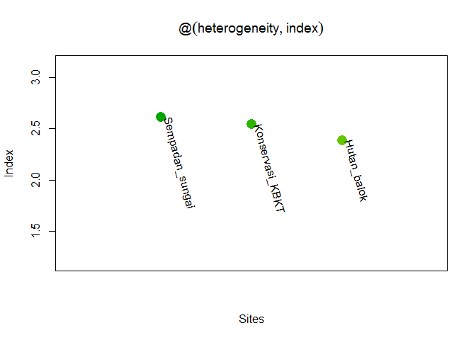
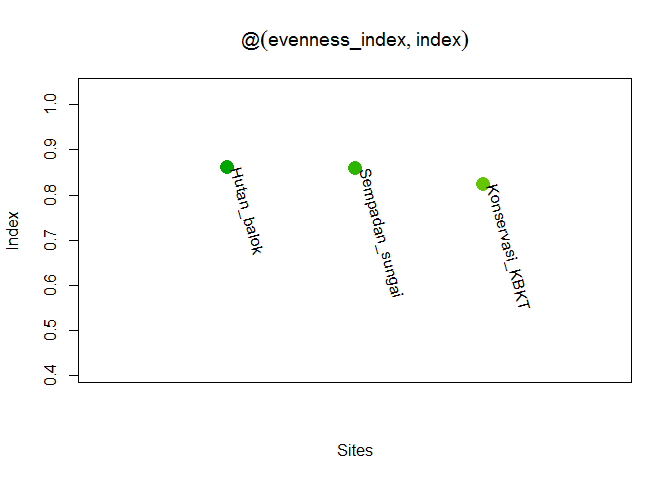
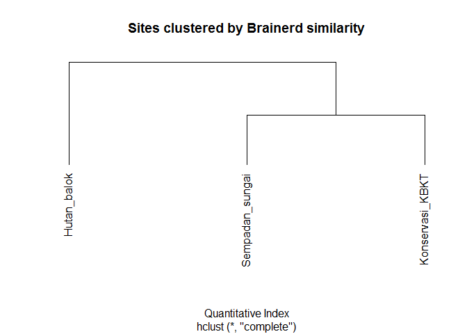
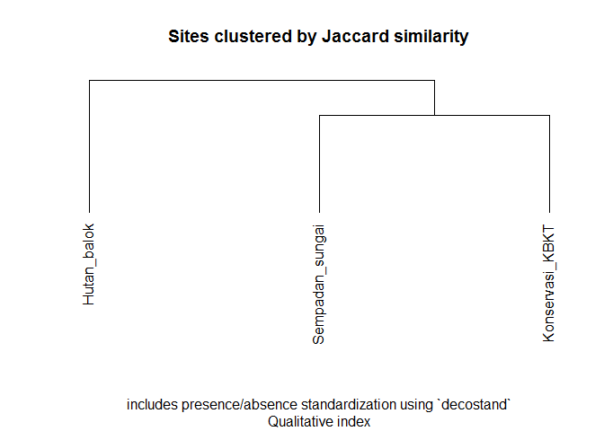
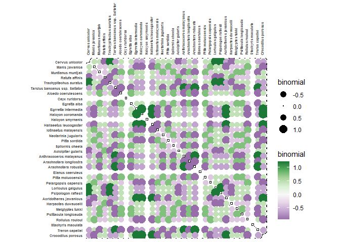
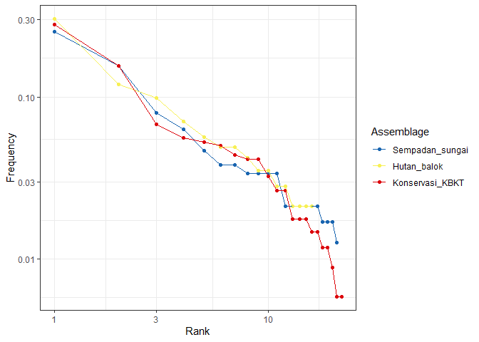

**Load packages**


```r
library(tabula)
library(magrittr)
library(khroma)
library(ggplot2)
library(openxlsx)
library(RFLPtools)
library(knitr)
```

**Reading and preparing data**


```r
df <- read.xlsx("C:/Users/rbbutar/Documents/R/Konservasi_ANJ/indeks_kehati/SMM/Indeks_kehati_SMM_2015 - 2020.xlsx", 
                sheet = "2018", cols = 1:5)
df <- df[,-2]
rownames(df) <- df[,1]
df <- df[,-1]
df <- t(df)

#Dropping columns sum 0
df <- as.data.frame(df)
df <- df[,!sapply(df, function(x) sum(x))==0]
kable(df, format = "pipe" )
```


|                | Cervus unicolor| Manis javanica| Muntianus muntjak| Ratufa affinis| Trachypitechus auratus| Tarsius bancanus ssp. Saltator| Alcedo coerulescens| Ceyx ruridorsa| Egretta alba| Egrretta intermedia| Halcyon coromanda| Halcyon smyrnenis| Haliaeetus leucogaster| Ictinaetus malayensis| Nectarinia jugularis| Pitta sordida| Spilornis cheela| Acicipiter gularis| Anthracoceros malayanus| Arachnotera longilostra| Arachnotera robusta| Elanus caeruleus| Pitta moluccensis| Pelargopsis capensis| Loriculus galgulus| Psipologon raflesii| Acridotheres javanicus| Harpactes duvaucelii| Meiglyptes tukki| Psittacula longicauda| Rollulus rouloul| Stachyris maculata| Treron capellei| Crocodilus porosus|
|:---------------|---------------:|--------------:|-----------------:|--------------:|----------------------:|------------------------------:|-------------------:|--------------:|------------:|-------------------:|-----------------:|-----------------:|----------------------:|---------------------:|--------------------:|-------------:|----------------:|------------------:|-----------------------:|-----------------------:|-------------------:|----------------:|-----------------:|--------------------:|------------------:|-------------------:|----------------------:|--------------------:|----------------:|---------------------:|----------------:|------------------:|---------------:|------------------:|
|Sempadan_sungai |               0|              0|                 3|              9|                      0|                              0|                   8|             19|            9|                   5|                 5|                60|                      4|                     0|                   37|             0|                4|                  5|                       0|                       4|                   0|               15|                 8|                    0|                  0|                   0|                     11|                    5|                8|                     5|                0|                  5|               0|                  8|
|Hutan_balok     |               0|              3|                 0|             17|                      0|                              3|                   0|             10|            0|                   0|                 0|                43|                      0|                     3|                    0|             7|                0|                  8|                       5|                       0|                   4|                3|                 0|                   14|                  0|                   0|                      0|                    4|                0|                     0|                5|                  6|               7|                  0|
|Konservasi_KBKT |               3|              2|                 4|              0|                      2|                              0|                  17|             18|           15|                   0|                 0|                95|                      0|                     4|                   53|            11|                9|                  0|                       0|                      14|                   0|               23|                 5|                   14|                  6|                   6|                      0|                    0|               19|                     6|                5|                  9|               0|                  0|

**Creating sorted plot template**


```r
make.sorted.plot <- function(x){
    ordered <- sort(x, T)
    plot(
        ordered,
        col = terrain.colors(10),
        xaxt = "n", pch = 16, cex = 2,
        ylim = c(min(ordered)*0.5, max(ordered)*1.2),
        xlim = c(0, length(x)+1),
        ylab = "Index", xlab = "Sites",
        main = substitute(x))
    text(ordered,
         names(ordered),
         srt = -75,
         pos = 4)
}
```


## A. Alpha - Diversity

Alpha diversity is the diversity within a praticular area or ecosystem

### 1. Richness and Rarefaction

The number of different taxa, provides an instantly comprehensible expression of diversity. While the number of taxa within a sample is easy to ascertain, as a term, it makes little sense: some taxa may not have been seen, or there may not be a fixed number of taxa (e.g. in an open system; Peet 1974). As an alternative, richness (R) can be used for the concept of taxa number (McIntosh 1967). Richness refers to the variety of taxa/species/types present in an assemblage or community (Bobrowsky and Ball 1989) as “the number of species present in a collection containing a specified number of individuals” (Hurlbert 1971).

It is not always possible to ensure that all sample sizes are equal and the number of different taxa increases with sample size and sampling effort (Magurran 1988). Then, rarefaction (S^) is the number of taxa expected if all samples were of a standard size n (i.e. taxa per fixed number of individuals). Rarefaction assumes that imbalances between taxa are due to sampling and not to differences in actual abundances.

### a. Species Number


```r
spec.numb <- data.frame(matrix(nrow = 0, ncol = 2))
colnames(spec.numb) <- c("site","species.number")
    for(i in seq_len(nrow(df))) {
        template <- data.frame(site = rownames(df)[i], 
                                species.number = sum(df[i,]!=0))
        spec.numb <- rbind(spec.numb,template)
    }
kable(spec.numb, caption = "Species Number")
```


Table: Species Number

|site            | species.number|
|:---------------|--------------:|
|Sempadan_sungai |             21|
|Hutan_balok     |             16|
|Konservasi_KBKT |             22|

### b. Richness Index

index_richness returns sample richness


```r
richness_index <- df %>% as_count() %>% index_richness(method = "margalef")
kable(richness_index@index, caption = "Richness Index Margalef", 
      col.names = "Richness_index")
```


Table: Richness Index Margalef

|                | Richness_index|
|:---------------|--------------:|
|Sempadan_sungai |       3.657604|
|Hutan_balok     |       3.026740|
|Konservasi_KBKT |       3.602710|

```r
make.sorted.plot(richness_index@index)
```

<!-- -->

### c. Composition Index

index_composition returns asymptotic species richness.


```r
composition_ind <- df %>% as_count() %>% index_composition(method = "chao1")
kable(composition_ind@index, 
      caption = "Composition Index with chao1 estimator", col.names = "composition_index")
```


Table: Composition Index with chao1 estimator

|                | composition_index|
|:---------------|-----------------:|
|Sempadan_sungai |                21|
|Hutan_balok     |                16|
|Konservasi_KBKT |                22|

### d. Rarefaction

rarefaction returns Hurlbert's unbiased estimate of Sander's rarefaction.


```r
rarefact <- df %>% as_count() %>% rarefaction(sample = 50, method = "hurlbert", simplify = T)
kable(rarefact, 
      caption = "Rarefaction Hurlbert's unbiased, n = 50",col.names = "rarefaction")
```


Table: Rarefaction Hurlbert's unbiased, n = 50

|                | rarefaction|
|:---------------|-----------:|
|Sempadan_sungai |    16.62887|
|Hutan_balok     |    14.16268|
|Konservasi_KBKT |    15.71343|


### 2. Heterogeneity and Evenness

Diversity measurement assumes that all individuals in a specific taxa are equivalent and that all types are equally different from each other (Peet 1974). A measure of diversity can be achieved by using indices built on the relative abundance of taxa. These indices (sometimes referred to as non-parametric indices) benefit from not making assumptions about the underlying distribution of taxa abundance: they only take relative abundances of the species that are present and species richness into account. Peet (1974) refers to them as indices of heterogeneity (H).

Diversity indices focus on one aspect of the taxa abundance and emphasize either richness (weighting towards uncommon taxa) or dominance (weighting towards abundant taxa; Magurran 1988).

Evenness (E) is a measure of how evenly individuals are distributed across the sample.

### a. Diversity Index


```r
heterogeneity <- df %>% as_count() %>% index_heterogeneity(method = "shannon")
kable(heterogeneity@index, 
      caption = "DIversity Index Shannon-Wiener Method", col.names = "diversity_index")
```


Table: DIversity Index Shannon-Wiener Method

|                | diversity_index|
|:---------------|---------------:|
|Sempadan_sungai |        2.613574|
|Hutan_balok     |        2.386350|
|Konservasi_KBKT |        2.542940|

```r
make.sorted.plot(heterogeneity@index)
```

<!-- -->

*The Shannon-Wiener index (Shannon 1948) assumes that individuals are randomly sampled from an infinite population and that all taxa are represented in the sample (it does not reflect the sample size). The main source of error arises from the failure to include all taxa in the sample: this error increases as the proportion of species discovered in the sample declines (Peet 1974; Magurran 1988). The maximum likelihood estimator (MLE) is used for the relative abundance, this is known to be negatively biased by sample size.*

> Note that `berger`, `mcintosh` and `simpson` methods return a dominance index, not the reciprocal form usually adopted, so that an increase in the value of the index accompanies a decrease in diversity.

Corresponding evenness can also be computed :

### b. Evenness Index


```r
evenness_index <- df %>% as_count() %>% index_evenness(method = "shannon")
kable(evenness_index@index,
      caption = "Evenness index Shannon-Wiener Method",
      col.names = "evenness_index")
```


Table: Evenness index Shannon-Wiener Method

|                | evenness_index|
|:---------------|--------------:|
|Sempadan_sungai |      0.8584512|
|Hutan_balok     |      0.8606937|
|Konservasi_KBKT |      0.8226804|

```r
make.sorted.plot(evenness_index@index)
```

<!-- -->

## B. Beta -diversity

Beta diversity is a comparison of diversity between ecosystems, usually measured as the amount of species change between the ecosystem.

### 1. Similarity

Jaccard, Morisita-Horn and Sorenson indices provide a scale of similarity from 0-1 where 1 is perfect similarity and 0 is no similarity. The Brainerd-Robinson index is scaled between 0 and 200.

### a. Brainerd-Robinson (similarity between assemblages)

- **Quantitative** similarity measures (between samples)
- Brainerd-Robinson quantitative index. This is a city-block metric of similarity between pairs of samples/cases.


```r
brainerd <- df %>% as_count %>% similarity(method = "brainerd")
brainerddata <-sim2dist(brainerd@.Data, maxSim = 200)
plot(
    hclust(brainerddata),
    hang = -1,
    main = "Sites clustered by Brainerd similarity",
    xlab = "Quantitative Index",
    axes = FALSE, ylab = ""
    )
```

<!-- -->


### b. Jaccard index (similarity between assemblages)

- **Qualitative** similarity measures (between samples)
-  This analysis includes presence/absence standardization using `decostand`


```r
jaccard <- df %>% as_count %>% similarity(method = "jaccard")
jaccarddata <- sim2dist(jaccard@.Data, maxSim = 1)
plot(
    hclust(jaccarddata),
    hang = -1,
    main = "Sites clustered by Jaccard similarity",
    xlab = "includes presence/absence standardization using `decostand`",
    sub = "Qualitative index",
    axes = FALSE, ylab = ""
    )
```

<!-- -->


### c. Binomial co-occurrence (similarity between types)

Binomial co-occurrence assessment. This assesses the degree of co-occurrence between taxa/types within a dataset. The strongest associations are shown by large positive numbers, the strongest segregations by large negative numbers.

- Similarity between pairs of taxa/types can be measured by assessing the degree of co-occurrence (binomial co-occurrence).
- The Binomial co-occurrence assessment approximates a Z-score.


```r
sim.types <- df %>% as_count %>% similarity(method = "binomial") %>%
            plot_spot() + khroma::scale_colour_PRGn() +
            theme(axis.text = element_text(size = 5, face = "bold"))
print(sim.types)
```

<!-- -->

## C. Abundance Model

Ranks vs abundance plot can be used for abundance models


```r
abund.model <- df %>% as_count() %>% 
            plot_rank(log = "xy", facet = FALSE) +
            ggplot2::theme_bw() + khroma::scale_color_discreterainbow()
print(abund.model)
```

<!-- -->


