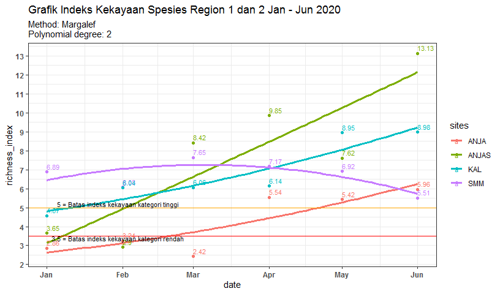
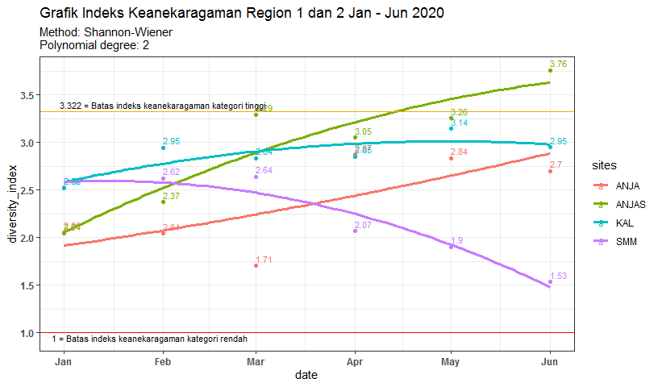
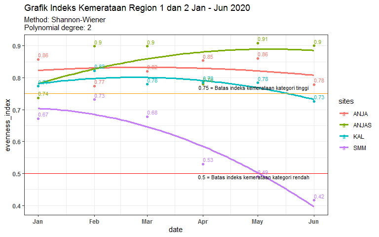

**Load packages**


```r
library(ggplot2)
library(dplyr)
library(plotly)
library(hrbrthemes)
library(openxlsx)
library(knitr)
```


```r
subjek <- "Region 1 dan 2"
range_x <- "Jan - Jun 2020"
filedata <- "data_jml_spesies_ANJ.xlsx"
```


## A. Species Richness Index 


```r
data <- read.xlsx(paste0(
    "C:/Users/rbbutar/Documents/R/Konservasi_ANJ/indeks_kehati/",
    filedata), sheet = "grafik_kekayaan",
    detectDates = TRUE)
data <- 
    #data[!(data$sites!=subjek),]
    data[!(data$sites == "ANJAP"| data$sites=="PMP"|data$sites=="PPM"),]
    #data[!(data$sites != "ANJAP"& data$sites!= "PMP"& data$sites!= "PPM"),]
kable(data, format = "pipe", caption = "Species Richness index Jan-June 2020")
```


Table: Species Richness index Jan-June 2020

|   |date       |sites | richness_index|
|:--|:----------|:-----|--------------:|
|1  |2020-01-01 |ANJA  |       2.859997|
|2  |2020-01-01 |ANJAS |       3.648859|
|3  |2020-01-01 |SMM   |       6.887420|
|4  |2020-01-01 |KAL   |       4.568487|
|8  |2020-02-01 |ANJA  |       3.244053|
|9  |2020-02-01 |ANJAS |       2.903512|
|10 |2020-02-01 |SMM   |       6.080884|
|11 |2020-02-01 |KAL   |       6.041760|
|15 |2020-03-01 |ANJA  |       2.421834|
|16 |2020-03-01 |ANJAS |       8.424115|
|17 |2020-03-01 |SMM   |       7.647399|
|18 |2020-03-01 |KAL   |       6.058599|
|22 |2020-04-01 |ANJA  |       5.537706|
|23 |2020-04-01 |ANJAS |       9.845815|
|24 |2020-04-01 |SMM   |       7.166537|
|25 |2020-04-01 |KAL   |       6.140196|
|28 |2020-05-01 |ANJA  |       5.421421|
|29 |2020-05-01 |ANJAS |       7.616776|
|30 |2020-05-01 |SMM   |       6.921845|
|31 |2020-05-01 |KAL   |       8.947091|
|35 |2020-06-01 |ANJA  |       5.963262|
|36 |2020-06-01 |ANJAS |      13.127674|
|37 |2020-06-01 |SMM   |       5.505840|
|38 |2020-06-01 |KAL   |       8.975126|

```r
attach(data)
```


```r
ggplot(data, aes(x=date, y=richness_index, group = sites, color = sites )) +
    #geom_line(stat = "smooth", size =1) + #change stat to "identity" for straight line
    #polynomial regression, adjust the poly degree to get a desired line of best fit.
    stat_smooth(method = "lm", formula = y~poly(x, 2), size = 1.2, se = F)+ 
    geom_point()+
    geom_hline(yintercept=3.5, color="red", size=.5) +
    geom_hline(yintercept = 5, color = "orange", size = .5)+
    geom_text(aes(label = round(richness_index,2)), size = 3, 
              position = position_dodge(width = 0), vjust = -0.5, hjust = 0) +
    scale_y_continuous(breaks = seq(0,15,1))+
    theme_bw() + 
    labs(title = paste("Grafik Indeks Kekayaan Spesies", subjek, range_x), 
         subtitle = "Method: Margalef \nPolynomial degree: 2")+
    annotate(geom="text", x= as.Date("2020-01-30", "%Y-%m-%d"), y=3.4, 
             label="3.5 = Batas indeks kekayaan kategori rendah",size = 3)+
    annotate(geom="text", x = as.Date("2020-01-30", "%Y-%m-%d"), y=5.2, 
             label="5 = Batas indeks kekayaan kategori tinggi", size = 3) +
    theme(
        axis.text = element_text(face = "bold"))
```

<!-- -->


## B. Diversity Index


```r
data <- read.xlsx(paste0(
    "C:/Users/rbbutar/Documents/R/Konservasi_ANJ/indeks_kehati/",
    filedata), sheet = "grafik_keanekaragaman",
    detectDates = TRUE)
data <- 
    #data[!(data$sites!=subjek),]
    data[!(data$sites == "ANJAP"| data$sites=="PMP"|data$sites=="PPM"),]
    #data[!(data$sites != "ANJAP"& data$sites!= "PMP"& data$sites!= "PPM"),]
kable(data, format = "pipe", caption = "Diversity index Jan-June 2020")
```


Table: Diversity index Jan-June 2020

|   |date       |sites | diversity_index|
|:--|:----------|:-----|---------------:|
|1  |2020-01-01 |ANJA  |        2.056750|
|2  |2020-01-01 |ANJAS |        2.042709|
|3  |2020-01-01 |SMM   |        2.526439|
|4  |2020-01-01 |KAL   |        2.520057|
|8  |2020-02-01 |ANJA  |        2.042700|
|9  |2020-02-01 |ANJAS |        2.371758|
|10 |2020-02-01 |SMM   |        2.622455|
|11 |2020-02-01 |KAL   |        2.945956|
|15 |2020-03-01 |ANJA  |        1.706057|
|16 |2020-03-01 |ANJAS |        3.292038|
|17 |2020-03-01 |SMM   |        2.638273|
|18 |2020-03-01 |KAL   |        2.835589|
|22 |2020-04-01 |ANJA  |        2.873193|
|23 |2020-04-01 |ANJAS |        3.053017|
|24 |2020-04-01 |SMM   |        2.070748|
|25 |2020-04-01 |KAL   |        2.853717|
|28 |2020-05-01 |ANJA  |        2.835416|
|29 |2020-05-01 |ANJAS |        3.255055|
|30 |2020-05-01 |SMM   |        1.902032|
|31 |2020-05-01 |KAL   |        3.143209|
|35 |2020-06-01 |ANJA  |        2.698825|
|36 |2020-06-01 |ANJAS |        3.757302|
|37 |2020-06-01 |SMM   |        1.533637|
|38 |2020-06-01 |KAL   |        2.949090|

```r
attach(data)
```


```r
ggplot(data, aes(x=date, y=diversity_index, group = sites, color = sites )) +
    #geom_line(stat = "smooth", size =1) + #change stat to "identity" for straight line
    #polynomial regression, adjust the poly degree to get a desired line of best fit.
    stat_smooth(method = "lm", formula = y~poly(x, 2), size = 1.2, se = F)+ 
    geom_point()+
    geom_hline(yintercept=1, color="red", size=.5) +
    geom_hline(yintercept =3.322, color = "orange", size = .5)+
    geom_text(aes(label = round(diversity_index,2)), size = 3, 
              position = position_dodge(width = 0), vjust = -0.5, hjust = 0) +
    scale_y_continuous(breaks = seq(0,5,0.5))+
    theme_bw() + 
    labs(title = paste("Grafik Indeks Keanekaragaman", subjek, range_x), 
         subtitle = "Method: Shannon-Wiener \nPolynomial degree: 2")+
    annotate(geom="text", x= as.Date("2020-01-28", "%Y-%m-%d"), y= 0.95 , 
             label="1 = Batas indeks keanekaragaman kategori rendah",size = 3)+
    annotate(geom="text", x = as.Date("2020-02-01", "%Y-%m-%d"), y=3.4, 
             label="3.322 = Batas indeks keanekaragaman kategori tinggi", size = 3) +
    theme(
        axis.text = element_text(face = "bold"))
```

<!-- -->


## C. Evenness Index


```r
data <- read.xlsx(paste0(
    "C:/Users/rbbutar/Documents/R/Konservasi_ANJ/indeks_kehati/",
    filedata), sheet = "grafik_kemerataan",
    detectDates = TRUE)
data <- 
    #data[!(data$sites!=subjek),]
    data[!(data$sites == "ANJAP"| data$sites=="PMP"|data$sites=="PPM"),]
    #data[!(data$sites != "ANJAP"& data$sites!= "PMP"& data$sites!= "PPM"),]
kable(data, format = "pipe", caption = "Evenness index Jan-June 2020")
```


Table: Evenness index Jan-June 2020

|   |date       |sites | evenness_index|
|:--|:----------|:-----|--------------:|
|1  |2020-01-01 |ANJA  |      0.8577313|
|2  |2020-01-01 |ANJAS |      0.7367515|
|3  |2020-01-01 |SMM   |      0.6717108|
|4  |2020-01-01 |KAL   |      0.7734752|
|8  |2020-02-01 |ANJA  |      0.7740264|
|9  |2020-02-01 |ANJAS |      0.8987141|
|10 |2020-02-01 |SMM   |      0.7318100|
|11 |2020-02-01 |KAL   |      0.8220846|
|15 |2020-03-01 |ANJA  |      0.8204400|
|16 |2020-03-01 |ANJAS |      0.8985895|
|17 |2020-03-01 |SMM   |      0.6779021|
|18 |2020-03-01 |KAL   |      0.7795248|
|22 |2020-04-01 |ANJA  |      0.8532641|
|23 |2020-04-01 |ANJAS |      0.7804188|
|24 |2020-04-01 |SMM   |      0.5293291|
|25 |2020-04-01 |KAL   |      0.7845084|
|28 |2020-05-01 |ANJA  |      0.8603023|
|29 |2020-05-01 |ANJAS |      0.9083404|
|30 |2020-05-01 |SMM   |      0.4913285|
|31 |2020-05-01 |KAL   |      0.7843642|
|35 |2020-06-01 |ANJA  |      0.7787163|
|36 |2020-06-01 |ANJAS |      0.9000847|
|37 |2020-06-01 |SMM   |      0.4157461|
|38 |2020-06-01 |KAL   |      0.7262976|

```r
attach(data)
```


```r
ggplot(data, aes(x=date, y=evenness_index, group = sites, color = sites )) +
    #geom_line(stat = "smooth", size =1) + #change stat to "identity" for straight line
    #polynomial regression, adjust the poly degree to get a desired line of best fit.
    stat_smooth(method = "lm", formula = y~poly(x, 2), size = 1.2, se = F)+ 
    geom_point()+
    geom_hline(yintercept=0.5, color="red", size=.5) +
    geom_hline(yintercept =0.75, color = "orange", size = .5)+
    geom_text(aes(label = round(evenness_index,2)), size = 3, 
              position = position_dodge(width = 0), vjust = -0.5, hjust = 0) +
    scale_y_continuous(breaks = seq(0,1,0.1))+
    theme_bw() + 
    labs(title = paste("Grafik Indeks Kemerataan", subjek, range_x), 
         subtitle = "Method: Shannon-Wiener \nPolynomial degree: 2")+
    annotate(geom="text", x= as.Date("2020-04-29", "%Y-%m-%d"), y= 0.49 , 
             label="0.5 = Batas indeks kemerataan kategori rendah",size = 3)+
    annotate(geom="text", x = as.Date("2020-04-29", "%Y-%m-%d"), y=0.77, 
             label="0.75 = Batas indeks kemerataan kategori tinggi", size = 3) +
    theme(
        axis.text = element_text(face = "bold"))
```

<!-- -->
