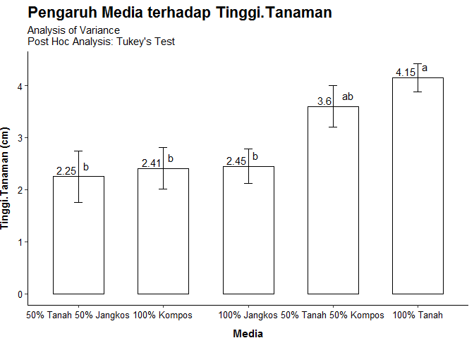

**Use this analysis based on homogeneity and normality test results**


```r
library(Rmisc)
library(agricolae)
library(ggplot2)
```


### **Reading and preparing data**

```r
df <- read.delim("Anggrek Tanah (Tinggi).txt")
satuan <- "(cm)"
head(df)
```

```
##        Media Tinggi.Tanaman
## 1 100% Tanah            4.2
## 2 100% Tanah            4.4
## 3 100% Tanah            4.5
## 4 100% Tanah            4.8
## 5 100% Tanah            2.5
## 6 100% Tanah            4.2
```

```r
attach(df)
```


### **One-way ANOVA**

```r
model <- lm(Tinggi.Tanaman ~ Media)
hasil_anova <- anova(model)
print(hasil_anova)
```

```
## Analysis of Variance Table
## 
## Response: Tinggi.Tanaman
##           Df Sum Sq Mean Sq F value   Pr(>F)   
## Media      4 28.917  7.2292  4.8479 0.002451 **
## Residuals 45 67.104  1.4912                    
## ---
## Signif. codes:  0 '***' 0.001 '**' 0.01 '*' 0.05 '.' 0.1 ' ' 1
```

### **Summary linear model**

```r
summ <- summary(model)
print(summ)
```

```
## 
## Call:
## lm(formula = Tinggi.Tanaman ~ Media)
## 
## Residuals:
##     Min      1Q  Median      3Q     Max 
## -1.8100 -0.8250 -0.0500  0.6375  4.2500 
## 
## Coefficients:
##                            Estimate Std. Error t value Pr(>|t|)    
## (Intercept)                  2.4500     0.3862   6.345  9.6e-08 ***
## Media100% Kompos            -0.0400     0.5461  -0.073  0.94194    
## Media100% Tanah              1.7000     0.5461   3.113  0.00322 ** 
## Media50% Tanah 50% Jangkos  -0.2000     0.5461  -0.366  0.71591    
## Media50% Tanah 50% Kompos    1.1500     0.5461   2.106  0.04083 *  
## ---
## Signif. codes:  0 '***' 0.001 '**' 0.01 '*' 0.05 '.' 0.1 ' ' 1
## 
## Residual standard error: 1.221 on 45 degrees of freedom
## Multiple R-squared:  0.3012,	Adjusted R-squared:  0.239 
## F-statistic: 4.848 on 4 and 45 DF,  p-value: 0.002451
```

### **Post Hoc: Tukey's HSD**

```r
independent <- colnames(df)[1]
dependent <- colnames(df)[2]
test_tukey <- HSD.test(model,kolom1, unbalanced = F)
print(test_tukey)
```

```
## $statistics
##   MSerror Df  Mean       CV      MSD
##    1.4912 45 2.972 41.08839 1.551754
## 
## $parameters
##    test name.t ntr StudentizedRange alpha
##   Tukey  Media   5         4.018417  0.05
## 
## $means
##                       Tinggi.Tanaman       std  r Min Max   Q25  Q50   Q75
## 100% Jangkos                    2.45 1.0522463 10 1.2 4.5 1.650 2.05 3.150
## 100% Kompos                     2.41 1.2493999 10 0.6 4.1 1.450 2.75 3.350
## 100% Tanah                      4.15 0.8695465 10 2.5 5.5 3.900 4.30 4.575
## 50% Tanah 50% Jangkos           2.25 1.5650701 10 0.8 6.5 1.600 1.80 2.325
## 50% Tanah 50% Kompos            3.60 1.2578642 10 2.1 5.5 2.525 3.60 4.350
## 
## $comparison
## NULL
## 
## $groups
##                       Tinggi.Tanaman groups
## 100% Tanah                      4.15      a
## 50% Tanah 50% Kompos            3.60     ab
## 100% Jangkos                    2.45      b
## 100% Kompos                     2.41      b
## 50% Tanah 50% Jangkos           2.25      b
## 
## attr(,"class")
## [1] "group"
```

```r
notasi <- test_tukey$groups[order(test_tukey$groups[,1]),]
notasi <- notasi[,2]
```

### **Summarizes data**
*Gives count, mean, standard deviation, standard error of the mean, and confidence interval (default 95%).*

```r
dat <- summarySE(data = df,dependent,groupvars = independent,conf.interval = 0.95)
dat <- dat[order(dat[,3]),]
print(dat)
```

```
##                   Media  N Tinggi.Tanaman        sd        se        ci
## 4 50% Tanah 50% Jangkos 10           2.25 1.5650701 0.4949186 1.1195837
## 2           100% Kompos 10           2.41 1.2493999 0.3950949 0.8937668
## 1          100% Jangkos 10           2.45 1.0522463 0.3327495 0.7527316
## 5  50% Tanah 50% Kompos 10           3.60 1.2578642 0.3977716 0.8998218
## 3            100% Tanah 10           4.15 0.8695465 0.2749747 0.6220361
```

### **ggPlot**

```r
##offset.v:kode instruksi untuk pengaturan posisi vertikal huruf hasil uji lanjut di atas nilai SE
offset.v = -0.8
##offset.h:kode instruksi untuk pengaturan posisi horizontal huruf hasil uji lanjut di atas nilai SE
offset.h = -0.8
#ggplot: kode instruksi untuk penyusunan grafik
#geom_bar: kode untuk pengaturan diagram batang)
#geom_errorbar: kode untuk pembubuhan SE di diagram batang)
#geom_text: kode untuk pembubuhan huruf, kata, frase atau kalimat di grafik)
#labs: kode untuk pengaturan nama judul sumbu x dan y)
#them_bw: kode pengaturan grafik hitam putih
#theme: kode pengaturan latar grafik, ukuran huruf, tipe huruf, dll)
variable <- dat[,3]
treatment <- dat[,1]
grafik <- ggplot(dat,
            aes(x= reorder(treatment,variable), y= variable),ymax=8,ymin=0.0)+
            geom_bar(stat="identity", fill="white",colour="black",width = 0.6)+
            geom_errorbar(aes(ymin=variable-se,
                    ymax=variable+se),width=0.1,size=0.6,colour="black") +
            geom_text(aes(label= notasi,hjust=offset.h, vjust=offset.v),size=4) +
            geom_text(aes(label=variable),position = position_dodge(width = 0.4),
                    vjust = -0.25, hjust = 1.1,size = 4)+
            labs(x = independent, y = paste(dependent,satuan), 
                    title = paste("Pengaruh",independent, "terhadap", dependent), 
                    subtitle = "Analysis of Variance \nPost Hoc Analysis: Tukey's Test") +
            theme_bw() +
            theme(panel.background = element_blank(),
                panel.grid.major = element_blank(),
                panel.grid.minor = element_blank(),
                panel.border = element_blank(),
                plot.title = element_text(size = rel(1.5),face = "bold",hjust=0),
                plot.subtitle = element_text(size = rel(1), hjust = 0),
                axis.title = element_text(face="bold",size = 11),
                axis.title.y = element_text(vjust = 4,size = 11),
                axis.title.x = element_text(vjust=-2, size=11),
                axis.line = element_line(colour="black"),
                axis.text = element_text(size = 10,color = "black"))
print(grafik)
```

<!-- -->

