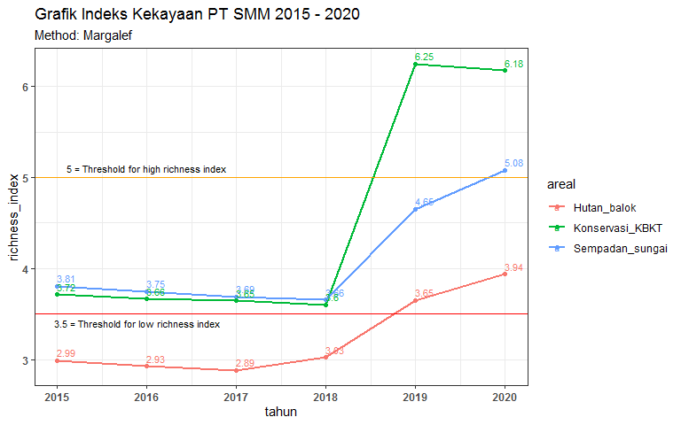
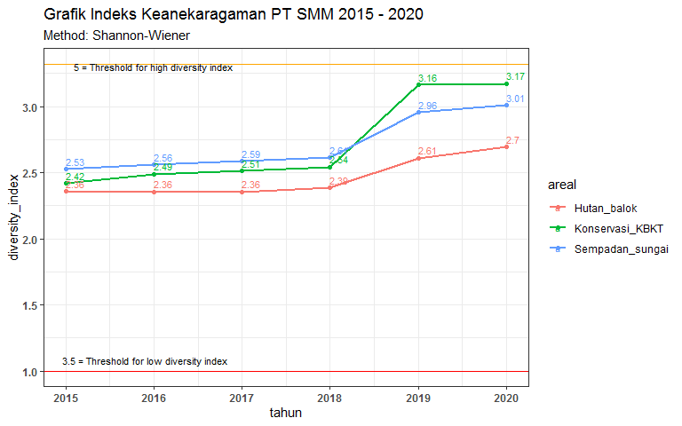
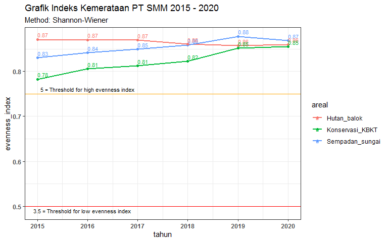

**Load packages**


```r
library(ggplot2)
library(dplyr)
library(plotly)
library(hrbrthemes)
```

## A. Species Richness PT SMM 2015 - 2020


```r
filedata <- "Indeks_kehati_SMM_2015 - 2020.xlsx"
```


```r
data <- read.xlsx(paste0(
    "C:/Users/rbbutar/Documents/R/Konservasi_ANJ/indeks_kehati/SMM/",
    filedata), 
    sheet = "grafik_richness")
kable(data, format = "pipe", caption = "Species Richness index 2015-2020")
```


Table: Species Richness index 2015-2020

| tahun|areal           | richness_index|
|-----:|:---------------|--------------:|
|  2015|Sempadan_sungai |       3.807875|
|  2015|Hutan_balok     |       2.990091|
|  2015|Konservasi_KBKT |       3.717489|
|  2016|Sempadan_sungai |       3.747046|
|  2016|Hutan_balok     |       2.929407|
|  2016|Konservasi_KBKT |       3.664858|
|  2017|Sempadan_sungai |       3.689673|
|  2017|Hutan_balok     |       2.885390|
|  2017|Konservasi_KBKT |       3.646529|
|  2018|Sempadan_sungai |       3.657604|
|  2018|Hutan_balok     |       3.026740|
|  2018|Konservasi_KBKT |       3.602710|
|  2019|Sempadan_sungai |       4.654134|
|  2019|Hutan_balok     |       3.651992|
|  2019|Konservasi_KBKT |       6.246512|
|  2020|Sempadan_sungai |       5.077977|
|  2020|Hutan_balok     |       3.937537|
|  2020|Konservasi_KBKT |       6.175725|

```r
attach(data)
```


```r
ggplot(data, aes(x=tahun, y=richness_index, group = areal, color = areal )) +
    geom_line(stat = "identity", size =1) +
    geom_point()+
    geom_hline(yintercept=3.5, color="red", size=.5) +
    geom_hline(yintercept = 5, color = "orange", size = .5)+
    geom_text(aes(label = round(richness_index,2)), size = 3, 
              position = position_dodge(width = 0), vjust = -0.5, hjust = 0) +
    theme_bw() + 
    labs(title = "Grafik Indeks Kekayaan PT SMM 2015 - 2020", 
         subtitle = "Method: Margalef")+
    annotate(geom="text", x= 2015.9, y=3.4, 
             label="3.5 = Threshold for low richness index",size = 3)+
    annotate(geom="text", x = 2016, y=5.1, 
             label="5 = Threshold for high richness index", size = 3) +
    theme(
        axis.text = element_text(face = "bold"))
```

<!-- -->

## B. Diversity Index PT SMM 2015-2020


```r
data <- read.xlsx(paste0(
    "C:/Users/rbbutar/Documents/R/Konservasi_ANJ/indeks_kehati/SMM/",
    filedata), 
    sheet = "grafik_diversity")
kable(data, format = "pipe", caption = "Diversity Index PT SMM 2015-2020")
```


Table: Diversity Index PT SMM 2015-2020

| tahun|areal           | diversity_index|
|-----:|:---------------|---------------:|
|  2015|Sempadan_sungai |        2.527933|
|  2015|Hutan_balok     |        2.360110|
|  2015|Konservasi_KBKT |        2.418851|
|  2016|Sempadan_sungai |        2.561298|
|  2016|Hutan_balok     |        2.355787|
|  2016|Konservasi_KBKT |        2.490580|
|  2017|Sempadan_sungai |        2.586450|
|  2017|Hutan_balok     |        2.355357|
|  2017|Konservasi_KBKT |        2.511629|
|  2018|Sempadan_sungai |        2.613574|
|  2018|Hutan_balok     |        2.386350|
|  2018|Konservasi_KBKT |        2.542940|
|  2019|Sempadan_sungai |        2.956544|
|  2019|Hutan_balok     |        2.610083|
|  2019|Konservasi_KBKT |        3.162655|
|  2020|Sempadan_sungai |        3.008852|
|  2020|Hutan_balok     |        2.695760|
|  2020|Konservasi_KBKT |        3.174623|

```r
attach(data)
```


```r
ggplot(data, aes(x=tahun, y=diversity_index, group = areal, color = areal )) +
    geom_line(stat = "identity", size =1) +
    geom_point()+
    geom_hline(yintercept=1, color="red", size=.5) +
    geom_hline(yintercept =3.322, color = "orange", size = .5)+
    geom_text(aes(label = round(diversity_index,2)), size = 3, 
              position = position_dodge(width = 0), vjust = -0.5, hjust = 0) +
    theme_bw() + 
    labs(title = "Grafik Indeks Keanekaragaman PT SMM 2015 - 2020", 
         subtitle = "Method: Shannon-Wiener")+
    annotate(geom="text", x= 2015.9, y= 1.08 , 
             label="3.5 = Threshold for low diversity index",size = 3)+
    annotate(geom="text", x = 2016, y=3.3, 
             label="5 = Threshold for high diversity index", size = 3) +
    theme(
        axis.text = element_text(face = "bold"))
```

<!-- -->

## C. Evenness Index PT SMM 2015-2020


```r
data <- read.xlsx(paste0(
    "C:/Users/rbbutar/Documents/R/Konservasi_ANJ/indeks_kehati/SMM/",
    filedata), 
    sheet = "grafik_evenness")
kable(data, format = "pipe", caption = "Evenness Index PT SMM 2015-2020")
```


Table: Evenness Index PT SMM 2015-2020

| tahun|areal           | evenness_index|
|-----:|:---------------|--------------:|
|  2015|Sempadan_sungai |      0.8303217|
|  2015|Hutan_balok     |      0.8715162|
|  2015|Konservasi_KBKT |      0.7825358|
|  2016|Sempadan_sungai |      0.8412809|
|  2016|Hutan_balok     |      0.8699199|
|  2016|Konservasi_KBKT |      0.8057411|
|  2017|Sempadan_sungai |      0.8495422|
|  2017|Hutan_balok     |      0.8697611|
|  2017|Konservasi_KBKT |      0.8125509|
|  2018|Sempadan_sungai |      0.8584512|
|  2018|Hutan_balok     |      0.8606937|
|  2018|Konservasi_KBKT |      0.8226804|
|  2019|Sempadan_sungai |      0.8780173|
|  2019|Hutan_balok     |      0.8573045|
|  2019|Konservasi_KBKT |      0.8516476|
|  2020|Sempadan_sungai |      0.8681713|
|  2020|Hutan_balok     |      0.8597561|
|  2020|Konservasi_KBKT |      0.8548704|

```r
attach(data)
```


```r
ggplot(data, aes(x=tahun, y=evenness_index, group = areal, color = areal )) +
    geom_line(stat = "identity", size =1) +
    geom_point()+
    geom_hline(yintercept=0.5, color="red", size=.5) +
    geom_hline(yintercept =0.75, color = "orange", size = .5)+
    geom_text(aes(label = round(evenness_index,2)), size = 3, 
              position = position_dodge(width = 0), vjust = -0.5, hjust = 0) +
    theme_bw() + 
    labs(title = "Grafik Indeks Kemerataan PT SMM 2015 - 2020", 
         subtitle = "Method: Shannon-Wiener")+
    annotate(geom="text", x= 2015.9, y= 0.49 , 
             label="3.5 = Threshold for low evenness index",size = 3)+
    annotate(geom="text", x = 2016, y=0.76, 
             label="5 = Threshold for high evenness index", size = 3) +
    theme(
        axis.text = element_text(face = "bold"))
```

<!-- -->
