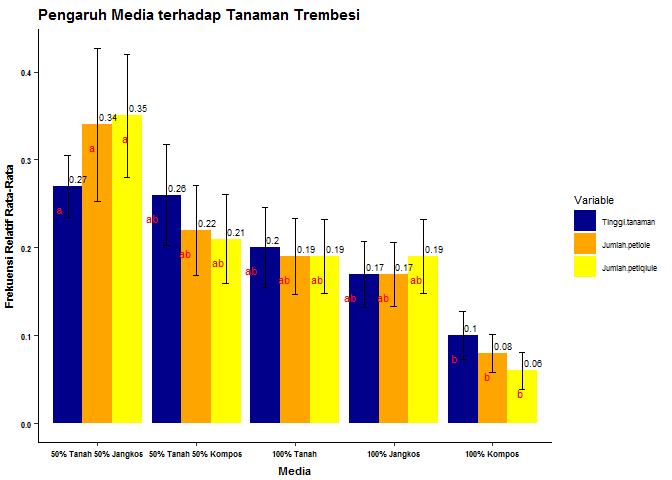

```r
library(tidyr)
library(Rmisc)
library(plyr)
library(ggplot2)
```


### **Reading and Preparing data**

```r
df <- read.delim("Trembesi_summary.txt")
kable(df, format = "html")
```

<table>
 <thead>
  <tr>
   <th style="text-align:left;"> Media </th>
   <th style="text-align:right;"> Tinggi.tanaman </th>
   <th style="text-align:right;"> Jumlah.petiole </th>
   <th style="text-align:right;"> Jumlah.petiqlule </th>
  </tr>
 </thead>
<tbody>
  <tr>
   <td style="text-align:left;"> 100% Tanah </td>
   <td style="text-align:right;"> 22.3 </td>
   <td style="text-align:right;"> 8 </td>
   <td style="text-align:right;"> 68 </td>
  </tr>
  <tr>
   <td style="text-align:left;"> 100% Tanah </td>
   <td style="text-align:right;"> 0.0 </td>
   <td style="text-align:right;"> 0 </td>
   <td style="text-align:right;"> 0 </td>
  </tr>
  <tr>
   <td style="text-align:left;"> 100% Tanah </td>
   <td style="text-align:right;"> 0.0 </td>
   <td style="text-align:right;"> 0 </td>
   <td style="text-align:right;"> 0 </td>
  </tr>
  <tr>
   <td style="text-align:left;"> 100% Tanah </td>
   <td style="text-align:right;"> 0.0 </td>
   <td style="text-align:right;"> 0 </td>
   <td style="text-align:right;"> 0 </td>
  </tr>
  <tr>
   <td style="text-align:left;"> 100% Tanah </td>
   <td style="text-align:right;"> 28.0 </td>
   <td style="text-align:right;"> 12 </td>
   <td style="text-align:right;"> 100 </td>
  </tr>
  <tr>
   <td style="text-align:left;"> 100% Tanah </td>
   <td style="text-align:right;"> 23.0 </td>
   <td style="text-align:right;"> 9 </td>
   <td style="text-align:right;"> 90 </td>
  </tr>
  <tr>
   <td style="text-align:left;"> 100% Tanah </td>
   <td style="text-align:right;"> 23.9 </td>
   <td style="text-align:right;"> 10 </td>
   <td style="text-align:right;"> 96 </td>
  </tr>
  <tr>
   <td style="text-align:left;"> 100% Tanah </td>
   <td style="text-align:right;"> 26.4 </td>
   <td style="text-align:right;"> 8 </td>
   <td style="text-align:right;"> 78 </td>
  </tr>
  <tr>
   <td style="text-align:left;"> 100% Tanah </td>
   <td style="text-align:right;"> 18.4 </td>
   <td style="text-align:right;"> 9 </td>
   <td style="text-align:right;"> 82 </td>
  </tr>
  <tr>
   <td style="text-align:left;"> 100% Tanah </td>
   <td style="text-align:right;"> 29.0 </td>
   <td style="text-align:right;"> 10 </td>
   <td style="text-align:right;"> 98 </td>
  </tr>
  <tr>
   <td style="text-align:left;"> 50% Tanah 50% Kompos </td>
   <td style="text-align:right;"> 28.0 </td>
   <td style="text-align:right;"> 9 </td>
   <td style="text-align:right;"> 98 </td>
  </tr>
  <tr>
   <td style="text-align:left;"> 50% Tanah 50% Kompos </td>
   <td style="text-align:right;"> 25.0 </td>
   <td style="text-align:right;"> 9 </td>
   <td style="text-align:right;"> 82 </td>
  </tr>
  <tr>
   <td style="text-align:left;"> 50% Tanah 50% Kompos </td>
   <td style="text-align:right;"> 33.0 </td>
   <td style="text-align:right;"> 15 </td>
   <td style="text-align:right;"> 156 </td>
  </tr>
  <tr>
   <td style="text-align:left;"> 50% Tanah 50% Kompos </td>
   <td style="text-align:right;"> 38.0 </td>
   <td style="text-align:right;"> 11 </td>
   <td style="text-align:right;"> 88 </td>
  </tr>
  <tr>
   <td style="text-align:left;"> 50% Tanah 50% Kompos </td>
   <td style="text-align:right;"> 0.0 </td>
   <td style="text-align:right;"> 0 </td>
   <td style="text-align:right;"> 0 </td>
  </tr>
  <tr>
   <td style="text-align:left;"> 50% Tanah 50% Kompos </td>
   <td style="text-align:right;"> 32.0 </td>
   <td style="text-align:right;"> 10 </td>
   <td style="text-align:right;"> 82 </td>
  </tr>
  <tr>
   <td style="text-align:left;"> 50% Tanah 50% Kompos </td>
   <td style="text-align:right;"> 30.0 </td>
   <td style="text-align:right;"> 12 </td>
   <td style="text-align:right;"> 102 </td>
  </tr>
  <tr>
   <td style="text-align:left;"> 50% Tanah 50% Kompos </td>
   <td style="text-align:right;"> 30.3 </td>
   <td style="text-align:right;"> 11 </td>
   <td style="text-align:right;"> 90 </td>
  </tr>
  <tr>
   <td style="text-align:left;"> 50% Tanah 50% Kompos </td>
   <td style="text-align:right;"> 0.0 </td>
   <td style="text-align:right;"> 0 </td>
   <td style="text-align:right;"> 0 </td>
  </tr>
  <tr>
   <td style="text-align:left;"> 50% Tanah 50% Kompos </td>
   <td style="text-align:right;"> 0.0 </td>
   <td style="text-align:right;"> 0 </td>
   <td style="text-align:right;"> 0 </td>
  </tr>
  <tr>
   <td style="text-align:left;"> 100% Kompos </td>
   <td style="text-align:right;"> 0.0 </td>
   <td style="text-align:right;"> 0 </td>
   <td style="text-align:right;"> 0 </td>
  </tr>
  <tr>
   <td style="text-align:left;"> 100% Kompos </td>
   <td style="text-align:right;"> 15.8 </td>
   <td style="text-align:right;"> 4 </td>
   <td style="text-align:right;"> 28 </td>
  </tr>
  <tr>
   <td style="text-align:left;"> 100% Kompos </td>
   <td style="text-align:right;"> 10.3 </td>
   <td style="text-align:right;"> 3 </td>
   <td style="text-align:right;"> 22 </td>
  </tr>
  <tr>
   <td style="text-align:left;"> 100% Kompos </td>
   <td style="text-align:right;"> 12.8 </td>
   <td style="text-align:right;"> 4 </td>
   <td style="text-align:right;"> 28 </td>
  </tr>
  <tr>
   <td style="text-align:left;"> 100% Kompos </td>
   <td style="text-align:right;"> 0.0 </td>
   <td style="text-align:right;"> 0 </td>
   <td style="text-align:right;"> 0 </td>
  </tr>
  <tr>
   <td style="text-align:left;"> 100% Kompos </td>
   <td style="text-align:right;"> 13.1 </td>
   <td style="text-align:right;"> 5 </td>
   <td style="text-align:right;"> 38 </td>
  </tr>
  <tr>
   <td style="text-align:left;"> 100% Kompos </td>
   <td style="text-align:right;"> 0.0 </td>
   <td style="text-align:right;"> 0 </td>
   <td style="text-align:right;"> 0 </td>
  </tr>
  <tr>
   <td style="text-align:left;"> 100% Kompos </td>
   <td style="text-align:right;"> 0.0 </td>
   <td style="text-align:right;"> 0 </td>
   <td style="text-align:right;"> 0 </td>
  </tr>
  <tr>
   <td style="text-align:left;"> 100% Kompos </td>
   <td style="text-align:right;"> 14.7 </td>
   <td style="text-align:right;"> 4 </td>
   <td style="text-align:right;"> 32 </td>
  </tr>
  <tr>
   <td style="text-align:left;"> 100% Kompos </td>
   <td style="text-align:right;"> 15.6 </td>
   <td style="text-align:right;"> 6 </td>
   <td style="text-align:right;"> 64 </td>
  </tr>
  <tr>
   <td style="text-align:left;"> 50% Tanah 50% Jangkos </td>
   <td style="text-align:right;"> 16.5 </td>
   <td style="text-align:right;"> 9 </td>
   <td style="text-align:right;"> 98 </td>
  </tr>
  <tr>
   <td style="text-align:left;"> 50% Tanah 50% Jangkos </td>
   <td style="text-align:right;"> 25.0 </td>
   <td style="text-align:right;"> 9 </td>
   <td style="text-align:right;"> 86 </td>
  </tr>
  <tr>
   <td style="text-align:left;"> 50% Tanah 50% Jangkos </td>
   <td style="text-align:right;"> 24.0 </td>
   <td style="text-align:right;"> 10 </td>
   <td style="text-align:right;"> 94 </td>
  </tr>
  <tr>
   <td style="text-align:left;"> 50% Tanah 50% Jangkos </td>
   <td style="text-align:right;"> 23.5 </td>
   <td style="text-align:right;"> 8 </td>
   <td style="text-align:right;"> 88 </td>
  </tr>
  <tr>
   <td style="text-align:left;"> 50% Tanah 50% Jangkos </td>
   <td style="text-align:right;"> 0.0 </td>
   <td style="text-align:right;"> 0 </td>
   <td style="text-align:right;"> 0 </td>
  </tr>
  <tr>
   <td style="text-align:left;"> 50% Tanah 50% Jangkos </td>
   <td style="text-align:right;"> 31.1 </td>
   <td style="text-align:right;"> 37 </td>
   <td style="text-align:right;"> 290 </td>
  </tr>
  <tr>
   <td style="text-align:left;"> 50% Tanah 50% Jangkos </td>
   <td style="text-align:right;"> 21.8 </td>
   <td style="text-align:right;"> 12 </td>
   <td style="text-align:right;"> 135 </td>
  </tr>
  <tr>
   <td style="text-align:left;"> 50% Tanah 50% Jangkos </td>
   <td style="text-align:right;"> 29.0 </td>
   <td style="text-align:right;"> 12 </td>
   <td style="text-align:right;"> 124 </td>
  </tr>
  <tr>
   <td style="text-align:left;"> 50% Tanah 50% Jangkos </td>
   <td style="text-align:right;"> 27.0 </td>
   <td style="text-align:right;"> 11 </td>
   <td style="text-align:right;"> 120 </td>
  </tr>
  <tr>
   <td style="text-align:left;"> 50% Tanah 50% Jangkos </td>
   <td style="text-align:right;"> 33.4 </td>
   <td style="text-align:right;"> 11 </td>
   <td style="text-align:right;"> 92 </td>
  </tr>
  <tr>
   <td style="text-align:left;"> 100% Jangkos </td>
   <td style="text-align:right;"> 19.0 </td>
   <td style="text-align:right;"> 8 </td>
   <td style="text-align:right;"> 76 </td>
  </tr>
  <tr>
   <td style="text-align:left;"> 100% Jangkos </td>
   <td style="text-align:right;"> 21.0 </td>
   <td style="text-align:right;"> 8 </td>
   <td style="text-align:right;"> 82 </td>
  </tr>
  <tr>
   <td style="text-align:left;"> 100% Jangkos </td>
   <td style="text-align:right;"> 19.1 </td>
   <td style="text-align:right;"> 8 </td>
   <td style="text-align:right;"> 88 </td>
  </tr>
  <tr>
   <td style="text-align:left;"> 100% Jangkos </td>
   <td style="text-align:right;"> 20.0 </td>
   <td style="text-align:right;"> 9 </td>
   <td style="text-align:right;"> 96 </td>
  </tr>
  <tr>
   <td style="text-align:left;"> 100% Jangkos </td>
   <td style="text-align:right;"> 0.0 </td>
   <td style="text-align:right;"> 0 </td>
   <td style="text-align:right;"> 0 </td>
  </tr>
  <tr>
   <td style="text-align:left;"> 100% Jangkos </td>
   <td style="text-align:right;"> 23.2 </td>
   <td style="text-align:right;"> 9 </td>
   <td style="text-align:right;"> 104 </td>
  </tr>
  <tr>
   <td style="text-align:left;"> 100% Jangkos </td>
   <td style="text-align:right;"> 0.0 </td>
   <td style="text-align:right;"> 0 </td>
   <td style="text-align:right;"> 0 </td>
  </tr>
  <tr>
   <td style="text-align:left;"> 100% Jangkos </td>
   <td style="text-align:right;"> 22.4 </td>
   <td style="text-align:right;"> 8 </td>
   <td style="text-align:right;"> 90 </td>
  </tr>
  <tr>
   <td style="text-align:left;"> 100% Jangkos </td>
   <td style="text-align:right;"> 20.6 </td>
   <td style="text-align:right;"> 7 </td>
   <td style="text-align:right;"> 80 </td>
  </tr>
  <tr>
   <td style="text-align:left;"> 100% Jangkos </td>
   <td style="text-align:right;"> 0.0 </td>
   <td style="text-align:right;"> 0 </td>
   <td style="text-align:right;"> 0 </td>
  </tr>
</tbody>
</table>


```r
attach(df)
```

**Gather the data to 'long' format so the variables are all in one column**

```r
longdata <- pivot_longer(df,c(Tinggi.tanaman, Jumlah.petiole, Jumlah.petiqlule), names_to = "variable")
kable(head(longdata), format = "pipe")
```


|Media      |variable         | value|
|:----------|:----------------|-----:|
|100% Tanah |Tinggi.tanaman   |  22.3|
|100% Tanah |Jumlah.petiole   |   8.0|
|100% Tanah |Jumlah.petiqlule |  68.0|
|100% Tanah |Tinggi.tanaman   |   0.0|
|100% Tanah |Jumlah.petiole   |   0.0|
|100% Tanah |Jumlah.petiqlule |   0.0|

### **Create summary statistics**

```r
summary <- longdata %>% summarySE(measurevar = "value", groupvars = c("Media","variable"))
kable(summary, format = "pipe")
```


|Media                 |variable         |  N|  value|        sd|         se|        ci|
|:---------------------|:----------------|--:|------:|---------:|----------:|---------:|
|100% Jangkos          |Jumlah.petiole   | 10|   5.70|  3.973524|  1.2565385|  2.842487|
|100% Jangkos          |Jumlah.petiqlule | 10|  61.60| 43.244011| 13.6749568| 30.934902|
|100% Jangkos          |Tinggi.tanaman   | 10|  14.53| 10.110286|  3.1971532|  7.232463|
|100% Kompos           |Jumlah.petiole   | 10|   2.60|  2.366432|  0.7483315|  1.692843|
|100% Kompos           |Jumlah.petiqlule | 10|  21.20| 21.399896|  6.7672414| 15.308563|
|100% Kompos           |Tinggi.tanaman   | 10|   8.23|  7.251827|  2.2932292|  5.187645|
|100% Tanah            |Jumlah.petiole   | 10|   6.60|  4.695151|  1.4847372|  3.358709|
|100% Tanah            |Jumlah.petiqlule | 10|  61.20| 43.330256| 13.7022302| 30.996598|
|100% Tanah            |Tinggi.tanaman   | 10|  17.10| 12.174290|  3.8498485|  8.708962|
|50% Tanah 50% Jangkos |Jumlah.petiole   | 10|  11.90|  9.480389|  2.9979623|  6.781862|
|50% Tanah 50% Jangkos |Jumlah.petiqlule | 10| 112.70| 72.366429| 22.8842741| 51.767825|
|50% Tanah 50% Jangkos |Tinggi.tanaman   | 10|  23.13|  9.448933|  2.9880149|  6.759359|
|50% Tanah 50% Kompos  |Jumlah.petiole   | 10|   7.70|  5.578729|  1.7641491|  3.990783|
|50% Tanah 50% Kompos  |Jumlah.petiqlule | 10|  69.80| 52.615587| 16.6385095| 37.638924|
|50% Tanah 50% Kompos  |Tinggi.tanaman   | 10|  21.63| 15.295319|  4.8368045| 10.941612|

### **Create relative frequency**
*note: .(variable) for quoting*

```r
dat <- ddply(summary,.(variable),transform, rel_freq = round(value/sum(value),2),
             se_freq = se/value*(value/sum(value)))
dat <- dat[order(dat$variable,-dat$value),]
dat["notasi"] <- c("a","ab","ab","ab","b","a","ab","ab","ab","b","a","ab","ab","ab","b") #notation from post hoc test
rownames(dat) <- seq_len(nrow(dat))
kable(dat,format = "pipe")
```


|Media                 |variable         |  N|  value|        sd|         se|        ci| rel_freq|   se_freq|notasi |
|:---------------------|:----------------|--:|------:|---------:|----------:|---------:|--------:|---------:|:------|
|50% Tanah 50% Jangkos |Jumlah.petiole   | 10|  11.90|  9.480389|  2.9979623|  6.781862|     0.34| 0.0868975|a      |
|50% Tanah 50% Kompos  |Jumlah.petiole   | 10|   7.70|  5.578729|  1.7641491|  3.990783|     0.22| 0.0511348|ab     |
|100% Tanah            |Jumlah.petiole   | 10|   6.60|  4.695151|  1.4847372|  3.358709|     0.19| 0.0430359|ab     |
|100% Jangkos          |Jumlah.petiole   | 10|   5.70|  3.973524|  1.2565385|  2.842487|     0.17| 0.0364214|ab     |
|100% Kompos           |Jumlah.petiole   | 10|   2.60|  2.366432|  0.7483315|  1.692843|     0.08| 0.0216908|b      |
|50% Tanah 50% Jangkos |Jumlah.petiqlule | 10| 112.70| 72.366429| 22.8842741| 51.767825|     0.35| 0.0700897|a      |
|50% Tanah 50% Kompos  |Jumlah.petiqlule | 10|  69.80| 52.615587| 16.6385095| 37.638924|     0.21| 0.0509602|ab     |
|100% Jangkos          |Jumlah.petiqlule | 10|  61.60| 43.244011| 13.6749568| 30.934902|     0.19| 0.0418835|ab     |
|100% Tanah            |Jumlah.petiqlule | 10|  61.20| 43.330256| 13.7022302| 30.996598|     0.19| 0.0419670|ab     |
|100% Kompos           |Jumlah.petiqlule | 10|  21.20| 21.399896|  6.7672414| 15.308563|     0.06| 0.0207266|b      |
|50% Tanah 50% Jangkos |Tinggi.tanaman   | 10|  23.13|  9.448933|  2.9880149|  6.759359|     0.27| 0.0353110|a      |
|50% Tanah 50% Kompos  |Tinggi.tanaman   | 10|  21.63| 15.295319|  4.8368045| 10.941612|     0.26| 0.0571591|ab     |
|100% Tanah            |Tinggi.tanaman   | 10|  17.10| 12.174290|  3.8498485|  8.708962|     0.20| 0.0454957|ab     |
|100% Jangkos          |Tinggi.tanaman   | 10|  14.53| 10.110286|  3.1971532|  7.232463|     0.17| 0.0377825|ab     |
|100% Kompos           |Tinggi.tanaman   | 10|   8.23|  7.251827|  2.2932292|  5.187645|     0.10| 0.0271003|b      |

### **Sorting x axis variables fill**

```r
dat$variable <- factor(dat$variable, levels = c("Tinggi.tanaman", "Jumlah.petiole", "Jumlah.petiqlule"))
```

### **Grafik ggplot**

```r
kolom1 <- colnames(df)[1]
grafik <- ggplot(dat, aes(x = reorder(Media,-rel_freq), y = rel_freq, fill = variable)) + 
    geom_bar(stat = 'identity', position = position_dodge(), width = 0.9) +
    geom_errorbar(aes(ymin = rel_freq - se_freq, ymax = rel_freq + se_freq), 
                  width = 0.2,position = position_dodge(0.9))+
    scale_fill_manual("Variable", values = c("dark blue","orange","yellow"))+ 
    geom_text(aes(label =rel_freq), size = 2.5, position = position_dodge(width = 0.9), 
              vjust = -0.5, hjust = -0.1)+
    geom_text(aes(label= notasi),hjust=1.4, vjust=3,size=3, 
              position = position_dodge(1), color = "red")+
    labs(x = kolom1, y = "Frekuensi Relatif Rata-Rata", title = paste("Pengaruh",kolom1, "terhadap", "Tanaman Trembesi"))+
    theme_bw() +
    theme(panel.background = element_blank(),
          panel.grid.major = element_blank(),
          panel.grid.minor = element_blank(),
          panel.border = element_blank(),
          plot.title = element_text(size = rel(1),face = "bold",hjust=0),
          axis.title = element_text(face="bold"),
          axis.title.y = element_text(vjust = 3,size = 8),
          axis.title.x = element_text(vjust=-1, size=8),
          axis.line = element_line(colour="black"),
          axis.text = element_text(size = 6,color = "black", face = "bold"),
          legend.text = element_text(size=6),
          legend.title = element_text(size = 8))
print(grafik)
```

<!-- -->

