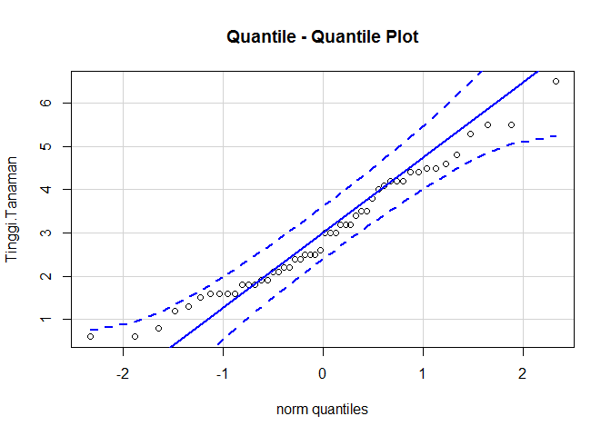
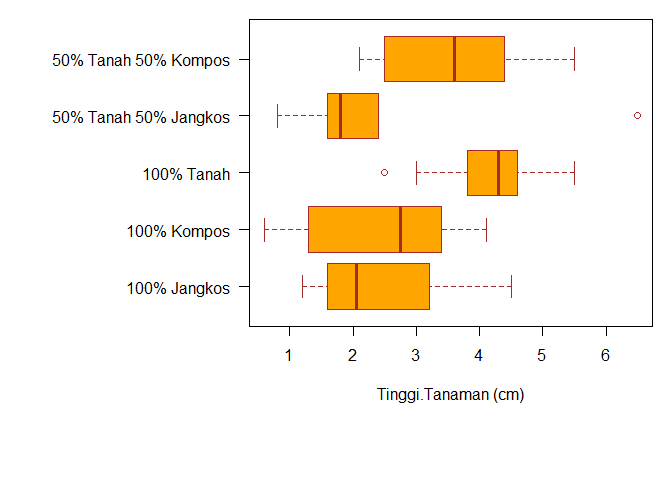

```r
library(FSA)
library(car)
library(nortest)
```


### **Reading and preparing data**

```r
df <- read.delim("Anggrek Tanah (Tinggi).txt")
head(df)
```

```
##        Media Tinggi.Tanaman
## 1 100% Tanah            4.2
## 2 100% Tanah            4.4
## 3 100% Tanah            4.5
## 4 100% Tanah            4.8
## 5 100% Tanah            2.5
## 6 100% Tanah            4.2
```

```r
dependent.var <- df[,2] #Column variabel dependent
independent.var <- df[,1]#Column variabel independent
satuan <- "(cm)"
```

### **Data descriptive summary**

```r
attach(df)
```


```r
df_summary <- data.frame(Summarize(Tinggi.Tanaman ~ Media, digits = 1))
print(df_summary)
```

```
##                   Media  n mean  sd min  Q1 median  Q3 max
## 1          100% Jangkos 10  2.5 1.1 1.2 1.6    2.0 3.1 4.5
## 2           100% Kompos 10  2.4 1.2 0.6 1.4    2.8 3.4 4.1
## 3            100% Tanah 10  4.2 0.9 2.5 3.9    4.3 4.6 5.5
## 4 50% Tanah 50% Jangkos 10  2.2 1.6 0.8 1.6    1.8 2.3 6.5
## 5  50% Tanah 50% Kompos 10  3.6 1.3 2.1 2.5    3.6 4.3 5.5
```

### **Homogeneity test**

#### Levene's test for homogeneity of variance.
*if p > 0.05 assumption of homogeneity fulfilled*

```r
levene <- suppressWarnings(leveneTest(Tinggi.Tanaman ~ Media, data = df))
print(levene)
```

```
## Levene's Test for Homogeneity of Variance (center = median)
##       Df F value Pr(>F)
## group  4  0.4955 0.7391
##       45
```

### **Normality test**
*if p > 0.05 assumption of normal distribution fulfilled*

#### Shapiro-Wilk Normality Test

```r
normalitas <- shapiro.test(Tinggi.Tanaman)
print(normalitas)
```

```
## 
## 	Shapiro-Wilk normality test
## 
## data:  Tinggi.Tanaman
## W = 0.96898, p-value = 0.2104
```

#### Kolmogorov-Smirnov Tests

```r
uji_ks <- suppressWarnings(ks.test(Tinggi.Tanaman,"pnorm",mean = mean(Tinggi.Tanaman), 
                            sd = sd(Tinggi.Tanaman)))
print(uji_ks)
```

```
## 
## 	One-sample Kolmogorov-Smirnov test
## 
## data:  Tinggi.Tanaman
## D = 0.11201, p-value = 0.5572
## alternative hypothesis: two-sided
```

#### Lilliefors (Kolmogorov-Smirnov) test for normality
Although the test statistic obtained from lillie.test(x) is the same as that obtained from ks.test(x, "pnorm", mean(x), sd(x)), it is not correct to use the p-value from the latter for the composite hypothesis of normality (mean and variance unknown), since the distribution of the test statistic is different when the parameters are estimated.


```r
lillie <- lillie.test(Tinggi.Tanaman)
print(lillie)
```

```
## 
## 	Lilliefors (Kolmogorov-Smirnov) normality test
## 
## data:  Tinggi.Tanaman
## D = 0.11201, p-value = 0.1211
```

### **Q-Q Plot**
A Q-Q plot is a scatterplot created by plotting two sets of quantiles against one another. If both sets of quantiles came from the same distribution, we should see the points forming a line that’s roughly straight.

```r
kol2 <- colnames(df)[2]
QQplot <- qqPlot(Tinggi.Tanaman, id = F, ylab = kol2, main = "Quantile - Quantile Plot")
```

<!-- -->

### **Box-and-whisker plot**

```r
box_whisker <- boxplot(Tinggi.Tanaman ~ Media, 
                        xlab = paste(kol2,satuan), ylab = "", col = "orange", border = 
                        "brown", horizontal = TRUE, las = 1, par(mar = c(8,13,1,1)))
```




